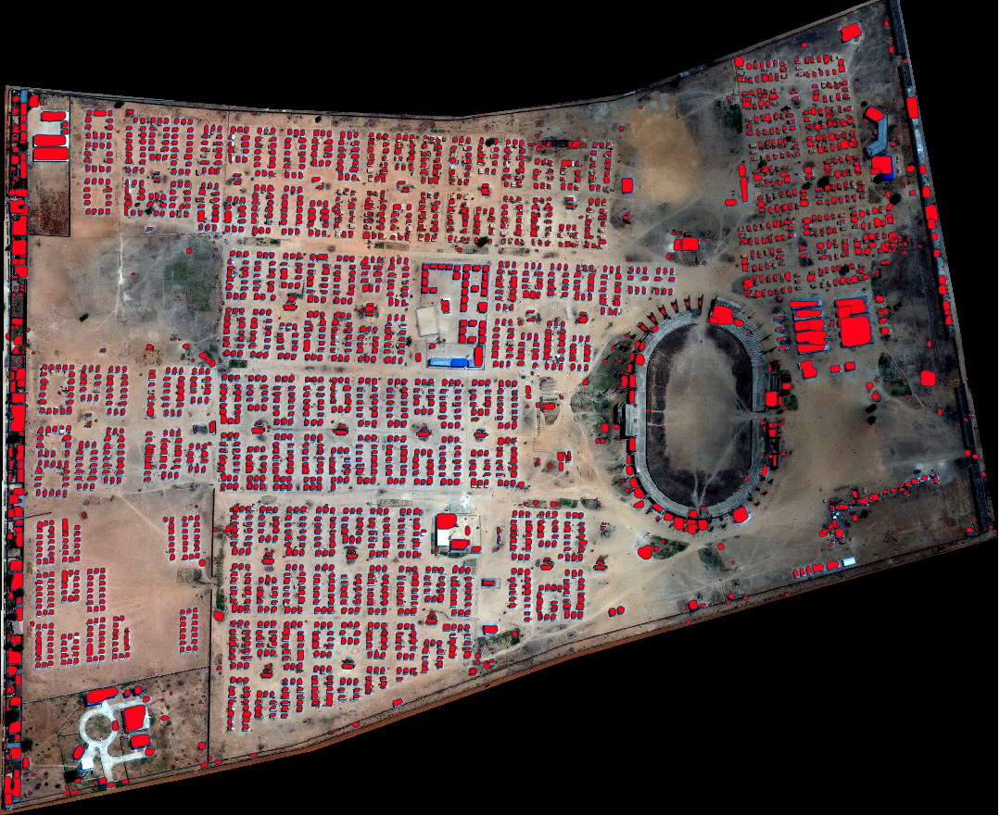

# UNOSAT-AI-Building-Footprint #

<div align="center">
  
</div>

The goal of UNOSAT-AI-Building-Footprint Project is to detect building on high resolution satellite imagery.
It can get the geojson file of the corresponding satellite imagery end to end.

### It consists of 4 parts:

1. Dataset Preparation: Convert Shpfile to coco format annotation

2. Detection Model: we use the DetectoRS as the detection model

3. The whole Satellite imagery inference strategy: 
Slice the whole satellite and convert the output of patches to the whole geojson file.

4. Shell scripts of the pipeline.
____
### 0. Install
____

We provide a Dockerfile to build an image for the pipline' environment. 

```shell
# build an image with PyTorch 1.3, CUDA 10.1,CUDNN 7
docker build --no-cache -t unosataifootprint .
```
		
Run it with 
 
```shell
nvidia-docker run -it --ipc=host -v {UNOSAT-Building-Footprint}:/workspace/Buildingfootprint unosataifootprint
```	
____
### 1. Dateset preparation
____

```shell
dataset_preparation.sh
```

____
### 2. Train the detection model
____

```shell
cd /DetectoRS-master-UNOSAT
tools/dist_train.sh {CONFIGS} {GPUNUMS}
```
for example: tools/dist_train.sh configs/DetectoRS/DetectoRS_mstrain_400_1200_r50_40e.py 4

____
### 3. Inferrence the whole satellite imagery
Just need put the satellite imagery on the OrgImage directory

Run the shell below
____

```shell
infer_tot.sh
```
We can get the corresponding output geojson file on the Output directly


aws


Account ID (12 digits) or account alias:601071647888

IAM user name:Sheng1994

Password:258369

UNOSAT-AI-Building-Footprint-ok


TO DO: 

Multi-GPU test

dist_test.sh

infer_json_test.py

ann_file.py

https://github.com/open-mmlab/mmdetection/issues/2167

## Thanks to the three open source code
[DetectoRS](https://github.com/joe-siyuan-qiao/DetectoRS)<br>
[simrdwn](https://github.com/avanetten/simrdwn)<br>
[shp2coco](https://github.com/DuncanChen2018/shp2coco)<br>

